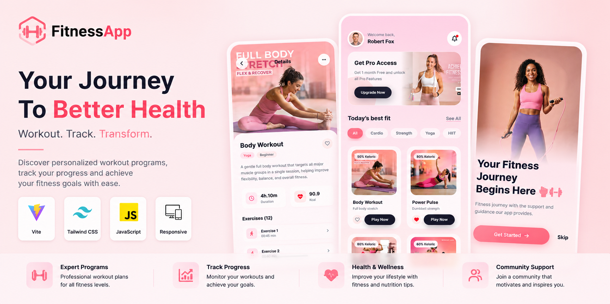
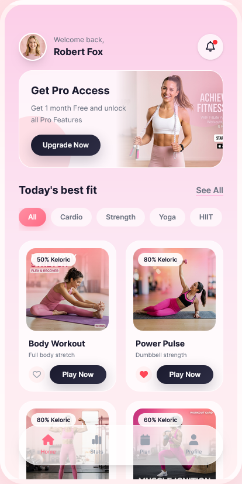
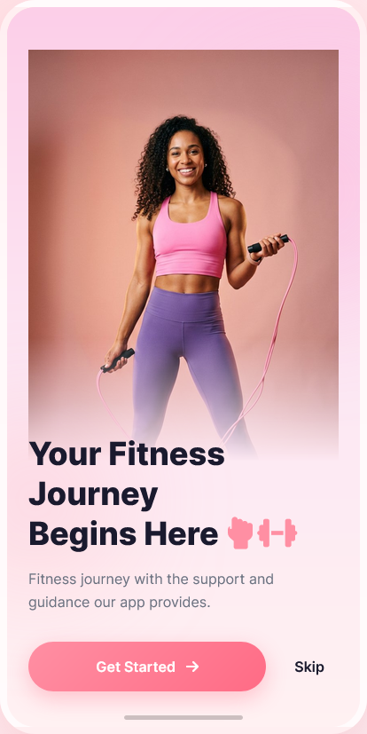
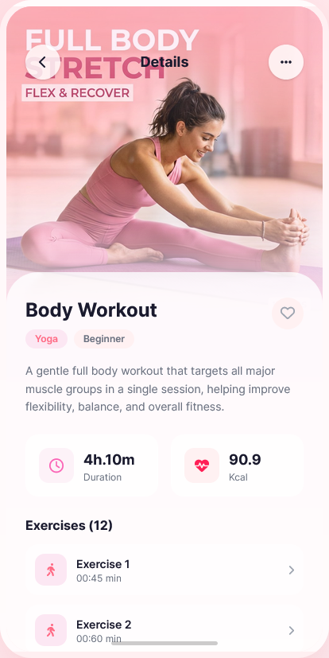

# FitnessApp

Modern Fitness Training & Wellness Platform

## Live Demo

https://fitness.paarlastudio.com

---

## Overview

FitnessApp is a modern fitness and wellness platform designed to help users discover workout programs, stay motivated, and achieve their personal fitness goals.

The platform combines a visually engaging interface with a responsive user experience, allowing users to explore training programs, fitness categories, exercise plans, and healthy lifestyle content.

Built with modern frontend technologies, FitnessApp focuses on performance, usability, and accessibility across desktop and mobile devices.

---

## Features

### Fitness Experience

* Workout Programs
* Exercise Categories
* Training Plans
* Fitness Challenges
* Motivational Sections
* Interactive UI Components

### User Experience

* Fully Responsive Design
* Mobile Optimized Layout
* Modern User Interface
* Smooth Navigation
* Accessible Components

### Technical Features

* Vite Development Environment
* Tailwind CSS Utility Architecture
* Modern JavaScript (ES6+)
* Component-Oriented Design
* Performance Optimization

---

## Technology Stack

* Vite
* Tailwind CSS
* JavaScript
* Responsive Design

---

## Screenshots

### Homepage

### Intro Page

### Fitness Workout Details

### Loading Page

---

## Project Goals

FitnessApp demonstrates how modern frontend technologies can be used to build engaging health and fitness experiences with strong focus on performance and user interaction.

Key goals include:

* Fast Performance
* Mobile First Design
* Modern UI/UX
* Scalable Frontend Structure

---

## Future Enhancements

* User Authentication
* Progress Tracking
* Workout History
* Nutrition Planning
* Community Features
* AI Fitness Recommendations
* Personal Trainer Dashboard

---

## Author

GitHub:
https://github.com/alirezahosseini

Portfolio:
https://elham.paarlastudio.com

---

## License

MIT License
